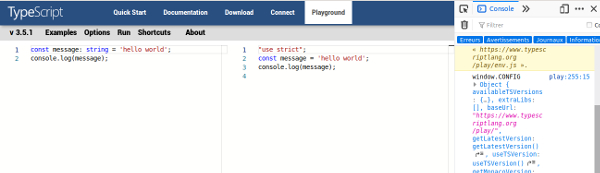

# algobase-training-course
# Etape 1: Déclaration et affectation d'une variable
Les variables permettent de stocker et manipuler des informations. Une variable est une zone de mémoire contenant des données. Les variables ont des noms permettant de les manipuler.

## Déclaration d'une variable
Une variable doit être déclarée à l'aide de son type.

Exemple:

    let nombre: number;

=> la variable s'appelle *nombre* et elle est de type *number*: un nombre.

> **i** En TypeScript, tous les nombres sont des valeurs en virgule flottante (positif / négatif, entier / décimaux).

> **i** Le point-virgule à la fin de la ligne permet de signaler à l'ordinateur la fin de l'instruction; il est obligatoire.

## Assignation d'une variable
La variable *nombre* existe donc et est utilisable mais aucune valeur n'a été définie.

On peut *définir* ou *assigner* une valeur à une variable dès sa définition ou a posteriori. Le caractère d'assignation est égal (=). 

    let nombre: number;
    nombre = 1;
ou

    let nombre: number = 2;

> **i** Pour une meilleure lisibilité de votre code, allez à la ligne après chaque fin d'instruction.

----

> Dans le début des exercices, nous utiliserons un "playground" de TypeScript pour écrire et exécuter le code: [https://www.typescriptlang.org/play/](https://www.typescriptlang.org/play/ "https://www.typescriptlang.org/play/")

1. Ouvrez le site dans un navigateur web (Firefox par exemple).
> Une console permet d'afficher les informations que l'on souhaite afficher
2. Affichez la console via: Outils > Outils de développement web > Outils puis cliquer sur "Console"
Le code est écrit dans la partie de droite, le résultat en Javascript obtenu après compilation est au centre, la console pour afficher des informations est à gauche:

3. Pour exécuter le code, cliquez sur le bouton "Run"

4. Pour afficher le contenu de variables, il faut utiliser la fonction

    console.log(lenomdemavariable).

----
## Question 1
Dans le playground, définissez une variable appelée monnombre qui contiendra un entier et dont la valeur sera de 100:

    let monnombre:number = 100;
    console.log(monnombre);

*Tout se passe bien (ie. aucun message d'erreur n'est affiché et le résultat attendu: "100" est affiché dans la console).*

> **i** Pour les langages compilés, les erreurs sont détectées lors de la compilation. Lisez avec attention les messages d'erreur donnés par le compilateur afin de corriger ces erreurs !

> Dans le playground, les erreurs sont soulignées avec des vagues rouges. 

> Nous vous conseillons de compiler régulièrement votre code afin de le corriger plutôt que de tout écrire puis de corriger les erreurs qui seront plus difficiles à trouver !

----
## Question 2

Ajoutez dans votre code:

* une variable de type entier nommée 2valeur

* une variable de type entier nommée mon nombre

Que se passe-t-il ? 

----
## Règles de nommage
Il n'y a pas de règle universelle pour nommer les variables. Cependant, des contraintes doivent être respectées:

* les noms des variables peuvent être composés des 26 lettres de l'alphabet en majuscule et en minuscules, des 10 chiffres et du caractère "tiret bas" (ou underscore) \_

* le caractère d'espacement n'est pas autorisé
* 
* le nom d'une variable ne peut pas commencer par un chiffre

----
## Question 3

Ajoutez dans votre code:
let nombre: number = 100;
console.log(Nombre);

Que se passe-t-il ? 

----
## Règles de nommage

> **i** Comme beaucoup de langages, TypeScript est sensible à la casse: les variables mmi et MMI sont donc deux variables différentes (et donc deux zones de mémoire distinctes) ! On privilégiera des noms de variables qui commencent par une minuscule

----
## Les nombres
Toutes les valeurs numériques sont contenues dans des variables de type *number*. Le séparateur des décimales est le point (*.*).

Exemple:

    let nombre: number = 1.5;

----
## Question 4
Rappel sur les variables: si l'on fait plusieurs affectations à la suite, la valeur de la variable sera modifiée (et donc l'ancienne valeur est écrasée) !

Qu'affiche le code suivant:

    let nombre: number = 1;
    nombre = 12;
    nombre = 12;
    nombre = 45;
    console.log(nombre);

----
## Opérations mathématiques
Les opérations classiques sur les nombres sont permises: addition (+), soustraction (-), multiplication (\*) et division (/). Il est également possible de faire une opération avec une valeur non contenue dans une variable (2\**nombre* par exemple).

----
## Question 5
Supprimez le code existant et faire:

    let nombre1: number = 10;
    let nombre2: number = 9;
    let somme: number  = nombre1 + nombre2;
    console.log(somme);

## Question 6
Modifiez le code de façon en ajoutant une nouvelle variable appelée *moyenne*, calculer et afficher la moyenne des deux nombres. Le résultat est-il correct ?

> **i** Il ne faut pas oublier que la moyenne est un nombre décimal. Ici, cela ne nous a pas posé de problème car dans le langage TypeScript, le type *number* permet de stocké tout type de nombre (entier ou décimal), ce qui n'est pas le cas de tous les langages !!

----
## Chaînes de caractères
Il est souvent utile de manipuler des caractères alpha-numériques (du texte !!) => string

Comme dans de nombreux langages, les caractères sont entourés par des guillemets simples ' (touche 4 sur un clavier azerty) ou par des guillemets double " (touche 3 sur un clavier azerty).

> **i** La fonction console.log peut être utilisée pour afficher des string.

## Question 7

Ajoutez le code suivant:

    let chaine1: string = "Ma première chaine";
    console.log(chaine1);

----
## Opérations sur les chaînes
Il est souvent utile de mettre bout-à-bout plusieurs chaînes de caractères pour former un message plus complet. Cette opération est appelée *concaténation* et est réalisée à l'aide du symbole +.

## Question 8
Ajoutez au code précédent:

    let chaine2: string = "ma deuxieme";
    let chainecomplete=chaine1+" et "+chaine2;
    console.log(chainecomplete);

> **i** le premier élément pour la concaténation est forcément une chaîne de caractère (soit dans une variable soit directement définie avec des apostrophes) et les éléments suivants peuvent être d'autre type comme *number* par exemple

=====
## Conclusions

* Les variables sont de différents types et le choix du type n'est pas anodin. Le type de contenu de la variable doit être connu du développeur.

* Attention au nommage des variables.
