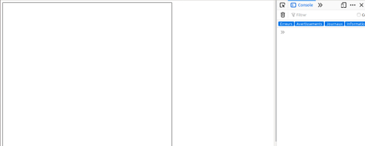
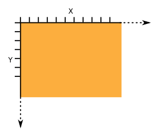
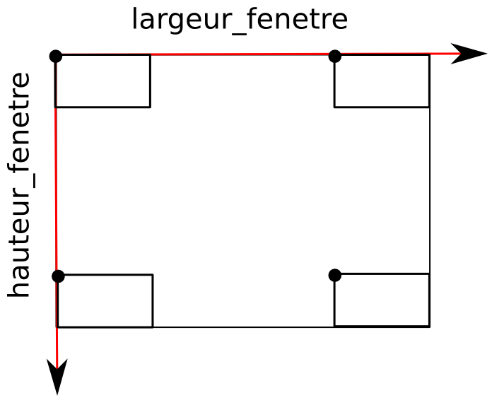

# algobase-training-course
# Etape 2: Un peu de visuel
Typescript est compilé pour générer du Javascript, langage utilisé côté client pour les sites internet. Nous allons donc maintenant utiliser du TypeScript pour afficher des éléments dans une page web. Nous nous focaliserons sur l'affichage d'éléments graphiques dans une fenêtre (un objet de type *canvas* en HTML).

Ouvrez la page index.html du dossier algobase-training-course dans un navigateur. De la même façon que précédemment, ouvrez la console de développement web pour voir les éléments affichés et/ou les erreurs.

La page est affichée à gauche et la console à droite. La zone de dessin (canvas) est encadrée en noir.

Dans la suite:

1. MODIFIER LE FICHIER moncode.ts (uniquement!!!!)
2. Compiler le code: > tsc moncode.ts
3. Actualiser la page index.html dans le navigateur (F5 ou bouton "Actualiser")
4. Voir le résultat

Copiez les codes dans un autre fichier si vous souhaitez les conserver.

----
## Explications initiales
Le fichier moncode.ts contient pour l'instant:

1. Une première ligne /// < reference path = "fonctions.ts" / >
 qui permet d'inclure les scripts codés dans le fichier fonctions.ts. NE JAMAIS EFFACER CETTE LIGNE. NOUS NE MODIFIERONS PAS CE FICHIER.
2. Une deuxième ligne: creerZoneDessin(); qui permet de créer ... la zone de dessin que nous avons vu sur la page index.html.

----
## Question 1
Ajoutez le code suivant à la suite:

    dessinerRectangle(10,10,200,100);
    dessinerRectangle(10,200,200,20);

Compilez le code et actualisez la page index.html.

> **i** Nous avons ici appelé plusieurs fois une même fonction mais avec des valeurs de paramètres différentes.

----
## Question 2
Intervertissez les lignes

    dessinerRectangle(10,200,200,20);
et

    creerZoneDessin();

Compilez et actualisez la page. Que se passe-t-il ?

## Explications
Attention à l'ordre des instructions. Ici, nous avons essayé de dessiner un rectangle alors que la zone de dessin n'existait pas encore !! D'où une erreur lors de l'exécution du code (alors qu'il n'y avait pas d'erreur lors de la compilation).

----
## Coordonnées et rectangle
Afin de tracer des figures géométriques, nous devons définir leur position. Pour cela, nous utilisons un repère (ici en 2 dimensions). L'origine de ce repère est situé en haut à gauche, l'axe horizontal (x) est dirigé vers la droite et l'axe vertical (y) vers le bas (repère classiquemet utilisé pour les images)

Pour tracer un rectangle, nous avons utilisé la fonction *dessinerRectangle* qui prend 4 arguments: x,y,largeur,hauteur. (x,y) correspond aux coordonnées du coin supérieur gauche du rectangle. Ainsi:

    dessinerRectangle(10,10,100,20);

permet de tracer un rectangle de 100pix de large et 20 de haut avec le coin en (10,10). Bien entendu, nous pouvons utiliser le contenu de variables:

    let positionX:number=100;
    let positionY:number =20;
    dessinerRectangle(positionX,positionY,100,20);

----
## Question 3
Supprimez les instructions pour dessiner puis ajoutez les codes pour afficher:

* un premier rectangle de taille 400x20 avec le coin en (0,0)
* un deuxième rectangle de taille 400x20 avec le coin en (0,100)
* un troisième rectangle de taille 400x20 avec le coin en (0,200)

## Question 4
Nous souhaitons modifier le code de façon à ce que les 3 rectangles aient les mêmes dimensions. Nous ajoutons au début du code des variables pour stocker ses valeurs:

    let largeur:number=400;
    let hauteur:number=20;

* Modifiez le code de façon à ce que les 3 rectangles aient cette largeur et cette hauteur (en utilisant les variables définiées).
* Compilez et affichez la page.
* Modifiez la valeur affectée à *largeur*; compilez et affichez: les largers et hauteurs de tous les rectangles sont modifiées !

----
## Question 5
Nous souhaitons maintenant que l'écart en hauteur entre chaque rectangle soit fixe (mais puisse être modifiée). Nous allons donc utiliser une variable contenant cet écart:

    let ecart:number=100;

Le coin du premier rectangle se situe en y=0, celui du 2ème rectangle se situe donc en 0+ecart et celui du 3ème en 0+2*ecart.

* Faîtes les modifications dans le code pour prendre en compte cet écart !
* Compilez et affichez la page.

----
## Question 6
Nous souhaitons afficher le dessin suivant (représenté ici avec les coordonnées):

Voici le code qui nous a été fourni:

    let tata:number=600;let gg:number=600;
    let bb:number=100;
    let hh:number=50;
    dessinerRectangle(0,0,bb,hh);dessinerRectangle(tata-bb,gg-hh,bb,hh);

    dessinerRectangle(0,gg-hh,bb,hh);

    dessinerRectangle(tata-bb,0,bb,hh);

Copiez-le, compilez et testez-le.

Simple question: avez-vous compris ce code ... peu compréhensible ??

## Un code durable !
L'idée est de générer un script utile aujourd'hui, demain et pourquoi pas dans 10 ans ! De nombreuses parties de code peuvent être encore utilisées sans grand changement même après l'évolution d'un programme complet. Il faut donc rendre le code source le plus compréhensible possible pour faciliter:

* les évolutions (on parle de mainenance évolutive)
* les corrections (on parle de maintenance corrective)

Reprendre son code source plusieurs mois après son écriture ou le code source de quelqu'un d'autre est toujours délicat ! Les temps de compréhension et les risques d'erreur puevent être réduits en suivant quelques bonnes pratiques.

## Question 7
Appliquons deux règles au code précédent:

* aérer son code => faîtes un retour à la ligne après chaque instruction
* séparer les différents éléments de son code => déplacez les instructions concernant les déclarations (et affectation) des variables au début

Compilez pour vérifier que vous n'avez pas fait d'erreur.

## Question 8
Appliquons une autre règle au code précédent:

* nommer de façon claire et explicite ses variables
    * remplacer tata par largeur_dessin et gg par hauteur_dessin
    * remplacer bb par largeur_rectangle et hh par hauteur_rectangle

Compilez pour vérifier que vous n'avez pas fait d'erreur.

----
## Autres figures géométriques
Est-il possible de dessiner d'autres figures géométriques ?

Vous ne savez pas ce qui est possible. Nous allons donc explorer la documentation. Celle-ci se présente sous la forme d'une page web que l'on peut retrouver ici: doc/index.html.

## Question 9
Tracez un cercle, un rectangle rempli, un segment, ...